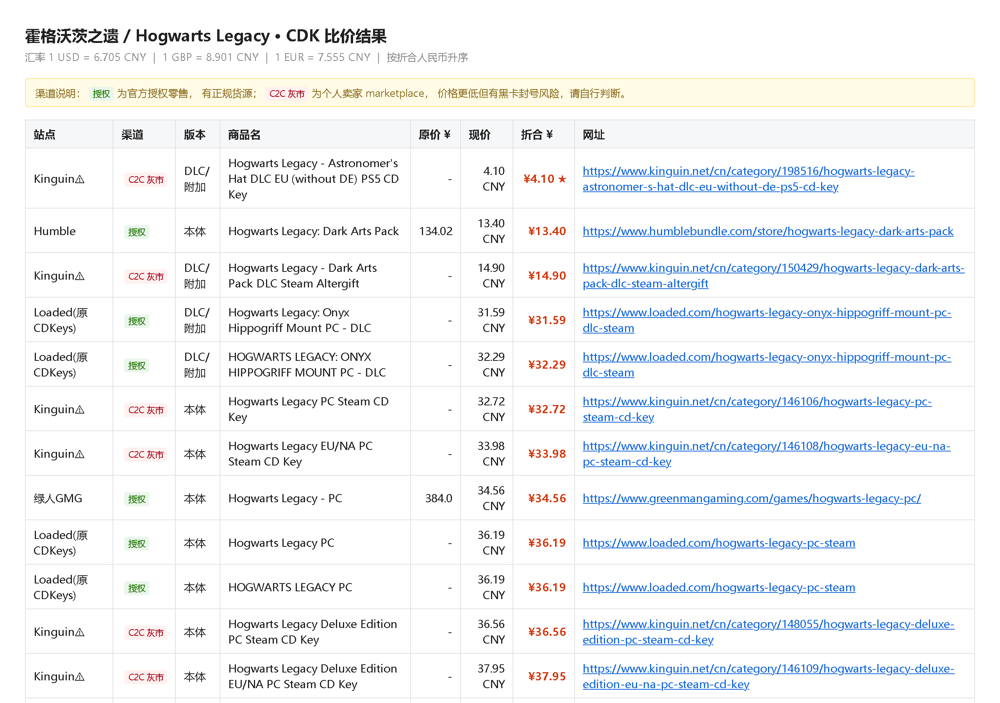

# 游戏 CDK 多站比价

输入一个游戏名，一次性从 **10 个 CDK 销售站** 抓价格，统一折算成人民币，按低价排序输出。
带一个双击就能用的本地网页版，也有命令行版。



## 特性

- **一个输入框**：填中文名或英文名都行，英文名不填会自动尝试解析
- **10 个站并发比价**：Humble / Fanatical / GMG / 杉果 / 凤凰 / 匹歪 / 2Game / Gamesplanet / Loaded / Kinguin
- **统一折算人民币**：实时汇率，按折合价升序，最低价标红加 ★
- **区分授权渠道与灰市**：C2C 灰市（个人卖家挂单）会打红色标签，便宜但有风险，自己权衡
- **自动过滤噪声**：剔掉周边、成品账号、共享账号，以及只命中一半关键词的无关商品
- **结果可点**：每行都是可点击的商品链接，双击也能打开
- **零 Web 框架依赖**：本地网页版用 stdlib `http.server` 实现

## ⚠️ 先读这段

**这个工具仅供个人比价和学习研究使用。** 用它之前请确认你接受以下几点：

1. **遵守目标网站的规定。** 各站的 `robots.txt` 与服务条款优先于本工具。对方明确拒绝自动访问时
   （返回 403 / Cloudflare 人机验证页），本项目不会去绕 —— 已经遇到好几个这样的站，直接放弃了，见下方清单。
2. **不要改造成批量爬取。** 默认并发 3、无代理池、无分布式，这是刻意的。
   本项目不提供也不鼓励任何规模化采集能力，别把它跑成定时任务去轮询价格。
3. **代码里的反爬处理只是为了拿到真实价格。** `curl_cffi` 的 TLS 指纹伪装和隐藏 webdriver
   标记，目的是让服务器把你当成一个普通浏览器用户 —— 很多站对非浏览器 UA 会拒绝服务或返回错误的价格页面。
   它不是为了对抗反爬系统，也不该被那样使用。
4. **价格仅供参考。** 以站点结算页为准，境外站实际支付还可能叠加信用卡手续费和汇率差。
5. **灰市风险自负。** Kinguin / 匹歪这类是个人卖家 marketplace，存在黑卡购买的 key 被 Steam 回收、
   共享账号被封的可能。表格里已用红色 `C2C 灰市` 标签标出。
6. **不收集任何数据。** 没有遥测、没有服务端，登录 cookie 只存在你自己机器的 `%APPDATA%\CDKPrice\`。

如果你打算 fork 后做商业用途或大规模采集，请自行取得各站授权，并自行承担法律后果。

## 快速开始

### 方式一：下载 exe（Windows，无需装 Python）

从 Releases 下载 `游戏CDK比价.exe`，双击运行：

1. 自动打开浏览器进入比价页面（没弹出就看黑窗口里打印的 `http://127.0.0.1:端口/`）
2. 填游戏名 → 勾选站点 → 点「开始比价」，等 30~60 秒
3. 结果列出 **站点 / 渠道 / 版本 / 商品名 / 原价 / 现价 / 折合人民币 / 网址**
4. 用完点页面上的「退出程序」，或关掉黑窗口

exe 调用系统自带的 Edge / Chrome，**不打包浏览器内核**，所以只有 52MB。
两个都没有才会回落到 Playwright 自带的 Chromium（那时需自行 `playwright install chromium`）。

### 方式二：从源码跑

```bash
git clone <你的仓库>
cd game-cdk-price
pip install -r requirements.txt
playwright install chromium    # 可选，系统有 Edge/Chrome 就不需要

python web_app.py              # 网页版，自动开浏览器
```

命令行版：

```bash
python cdk_price.py 霍格沃茨之遗
python cdk_price.py 艾尔登法环 --en "Elden Ring"
python cdk_price.py 赛博朋克2077 --sites humble,gmg,sonkwo
python cdk_price.py 黑神话悟空 --html r.html --json r.json --csv r.csv
python cdk_price.py --login steampy          # 匹歪需先登录一次
```

| 参数 | 作用 |
| --- | --- |
| `--en` | 英文名，境外站用它搜索 |
| `--sites` | 只查指定站点（humble / fanatical / gmg / sonkwo / fhyx / steampy / 2game / gamesplanet / loaded / kinguin） |
| `--all` | 保留 DLC、原声、周边等全部结果（默认过滤周边和成品账号） |
| `--top N` | 只看最便宜的 N 条 |
| `--fx 7.2` | 手动指定美元汇率 |
| `--login` | 保存某站登录态 |
| `--debug` | 把原始抓取结果写到 `debug_last.json` 用于排错 |

## 各站实现现状

| 站点 | 渠道 | 状态 | 取数方式 |
| --- | --- | --- | --- |
| Humble Bundle | 授权 | ✅ | 公开 JSON 接口 `/store/api/search`，无需浏览器，最快最稳 |
| Fanatical | 授权 | ✅ | 浏览器渲染，卡片 `.hitCardStripe`；`/book/` `/comic/` 是漫画书，已过滤 |
| 绿人 GMG | 授权 | ✅ | 浏览器渲染，读卡片 `ng-init` 里 UTF-16LE base64 的商品 JSON |
| 杉果 | 授权 | ✅ | `/store/search?keyword=`（不是 `/search`），卡片 `.search-result-item-sku` |
| 凤凰 | 授权 | ✅ | **必须先打开首页再用搜索框提交**，直接访问搜索页会空白 |
| 2Game | 授权 | ✅ | `div.form-product-card-2game-container` + `span.price-main`，中文站直接给人民币价 |
| Gamesplanet | 授权 | ✅ | `div.game_list` + `span.price_current`（走 us 站，美元价） |
| Loaded（原 CDKeys） | 授权 | ✅ | Magento 站，`div.product-info` + `span.price` |
| 匹歪 SteamPY | C2C 灰市 | ⚠️ 需登录 | 搜索接口要登录，网页版点「登录匹歪」或命令行 `--login steampy` |
| Kinguin | C2C 灰市 | ✅ | `span.min` 价格 + 向上找 `a[href*="/category/"]` 拿标题链接（类名是哈希，不能依赖） |
| 小黑盒 | — | ❌ | 网页端已关搜索（只剩下载落地页），旧接口对任意关键词都返回空 |

### 没能加进来的站

| 站点 | 原因 |
| --- | --- |
| Instant Gaming | Cloudflare 拦截，浏览器也停在 "Just a moment…" |
| GG.deals | 同上，Cloudflare 人机验证 |
| G2A | 403（且本身就是 C2C 灰市，风险高于 Kinguin） |
| GameBillet | 403 |

## 要注意的点

- **汇率**：默认实时获取（frankfurter.app），失败回退内置值，可用 `--fx` 覆盖。
- **地区**：境外站显示的是中国区可见价格，部分游戏中国区没货会显示「无匹配结果」，
  这不是抓取失败。例如艾尔登法环在 Humble 和 GMG 中国区就没有。
- **相关度过滤**：默认剔除与关键词不相关的结果，以及周边/成品账号（`Accounts` / `Access`
  这类共享账号一并过滤），想看全部勾「显示全部」。
- **广义词兜底**：多词关键词（如 `cyberpunk 2077`）在严格 AND 匹配的站上可能 0 结果，
  此时会自动用其中最长的单词再搜一次，靠相关度过滤兜住噪声。
- **价格口径**：`原价` 是站点标示的划线价，`现价` 是当前售价，最后一列统一折算人民币。
- 站点改版会让选择器失效，用 `--debug` 导出原始数据排查，改 `sites.py` 里对应配置即可。

## 文件

| 文件 | 作用 |
| --- | --- |
| `web_app.py` | **本地网页版**，exe 的入口（stdlib `http.server`，无第三方 Web 框架） |
| `core.py` | 浏览器会话（Edge→Chrome→Chromium）、并发抓取、汇率、英文名解析、结果整理 |
| `sites.py` | 各站适配器（改选择器改这里） |
| `cdk_price.py` | 命令行入口 |
| `report.py` | HTML / JSON / CSV 导出 |
| `gui.py` | tkinter 桌面窗口版（**当前 Python 没带 tkinter，跑不起来**；换带 tkinter 的 Python 可用） |
| `probe*.py` `dump_*.py` `sniff.py` `dom_*.py` `discover.py` `fhyx_check.py` `gmg_test.py` `verify_price.py` `test_new4.py` | 开发期勘察各站接口和 DOM 的脚本，站点改版后可用来重新侦察 |

登录态保存在 `%APPDATA%\CDKPrice\`（打包后 `core.ROOT` 会指向临时目录，所以特意改到了用户目录）。

自己打包：

```bash
pyinstaller --onefile --console --noconfirm --name "游戏CDK比价" \
  --collect-all playwright --collect-all curl_cffi --collect-all certifi web_app.py
```

## 参与

欢迎加新站点、修失效的站点，流程见 [CONTRIBUTING.md](CONTRIBUTING.md)。
提 issue 时附一份 `--debug` 导出的 `debug_last.json` 会快很多（记得先清掉个人信息）。

## 许可证

[MIT](LICENSE) © 2026 <Your Name>

本项目与各比价站点无任何关联，不代售任何商品，也不对交易结果负责。
